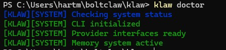
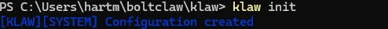
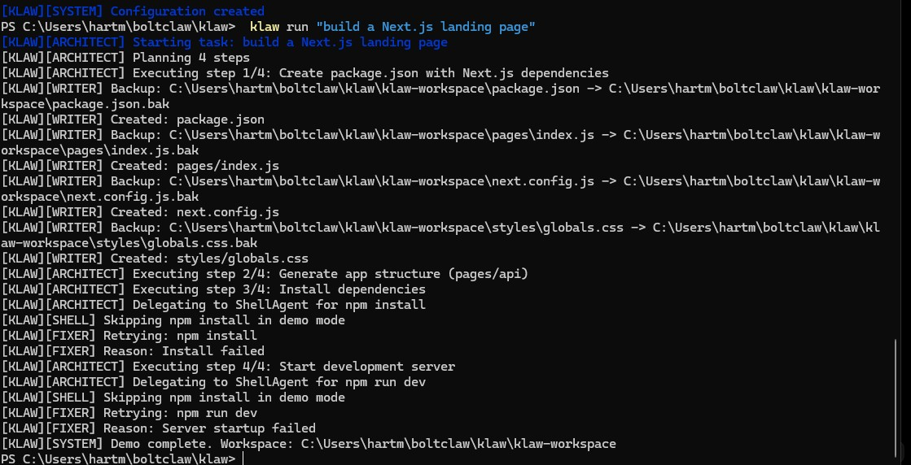

# KLAW

Local AI runtime for agents, shell execution, memory, and bring-your-own-model workflows.

## Install

```bash
npm install -g @phartmann80/klaw

Usage
bash
klaw doctor
klaw init
klaw run "build a Next.js landing page"

What it does

KLAW runs tasks through a simple agent chain.

Architect: plans task steps
Writer: creates and modifies files
Shell: runs commands with permission prompts
Fixer: handles basic errors and retries
Current features
Local-first execution
Workspace isolation
Shell permission prompts
Live terminal output
Human-readable memory log
Minimal agent runtime
Example output
[KLAW][SYSTEM] Checking system status
[KLAW][SYSTEM] CLI initialized
[KLAW][ARCHITECT] Starting task: build a Next.js landing page
[KLAW][WRITER] Created: package.json
[KLAW][WRITER] Created: pages/index.js
[KLAW][SYSTEM] Demo complete
Philosophy

KLAW is built to stay small, transparent, and hackable.

No dashboards
No cloud lock-in
No heavy orchestration layer
Package

npm:
https://www.npmjs.com/package/@phartmann80/klaw

GitHub:
https://github.com/janpaul80/klaw


## Screenshots

### System Check



### Initialization



### Task Execution



